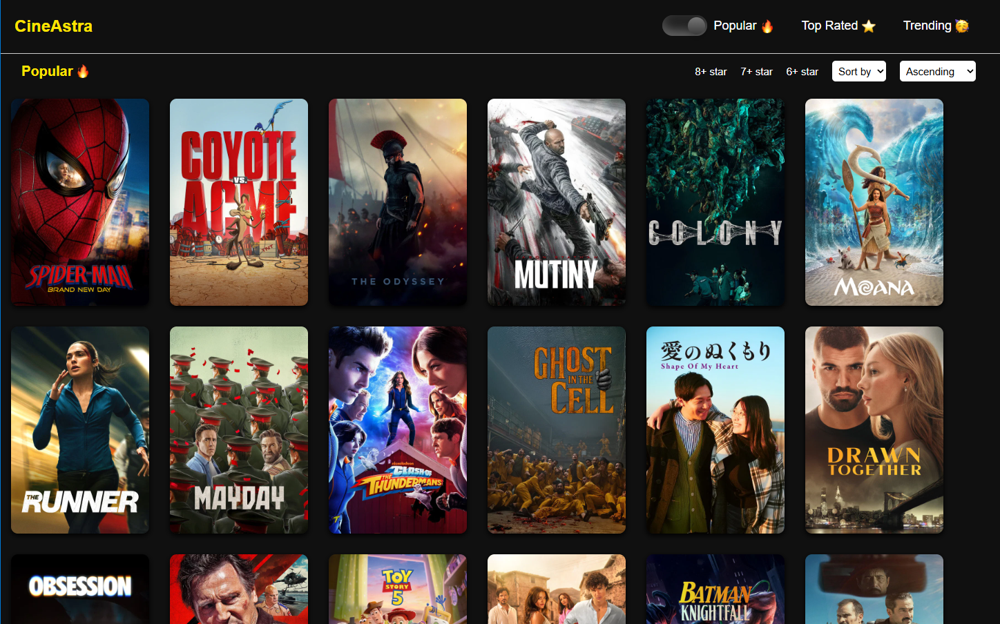

# 🎬 Movie Project

A movie browsing website built with **React.js** as part of my React learning journey.

The project focuses on building a functional and responsive movie interface while practicing React fundamentals, component-based development, state management, API integration, and routing.

## ✨ Features

* 🎥 Browse and explore movies
* 🔍 Search for movies
* ⭐ Display movie ratings
* 🎞️ Movie cards with posters and movie details
* 📄 View individual movie details
* 🌐 Fetch movie data using an API
* ⚛️ Reusable React components
* 🧭 Client-side navigation using React Router
* 📱 Responsive user interface
* 🎨 Custom CSS styling

## 📸 Project Preview



## 🛠️ Technologies Used

* **React.js**
* **JavaScript**
* **HTML5**
* **CSS3**
* **Vite**
* **React Router**
* **REST API**

## 🎯 Purpose

This project was created as part of my journey learning **React.js**. It helped me practice building components, passing props, managing state, handling API requests, working with routes, and creating a responsive user interface.

## 🤖 AI Usage

**No AI was used to write or generate the project's code.**

The project was built manually as part of my learning process to understand React and improve my frontend development skills.

## ▶️ Run Locally

Clone the repository:

```bash
git clone <your-repository-url>
```

Navigate to the project directory:

```bash
cd 20movieproject
```

Install dependencies:

```bash
npm install
```

Start the development server:

```bash
npm run dev
```

The application will be available at the local URL provided by Vite.

## 👨‍💻 Author

**Jafrin Shajan**
